# CHAPTER 3: METHODOLOGY

## 3.1 Introduction

This chapter presents the systematic approach employed in designing and implementing the Smart Energy Monitoring and Safety System. The methodology encompasses system architecture design, hardware integration, software development, and algorithm implementation. A modular approach was adopted to ensure maintainability, scalability, and ease of debugging.

---

## 3.2 System Architecture

### 3.2.1 Overall System Architecture

The system follows a layered architecture pattern with clear separation of concerns:

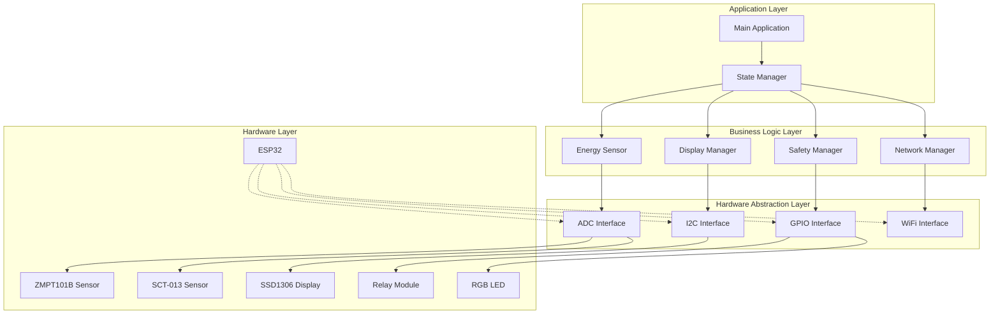

### 3.2.2 Module Interaction Diagram

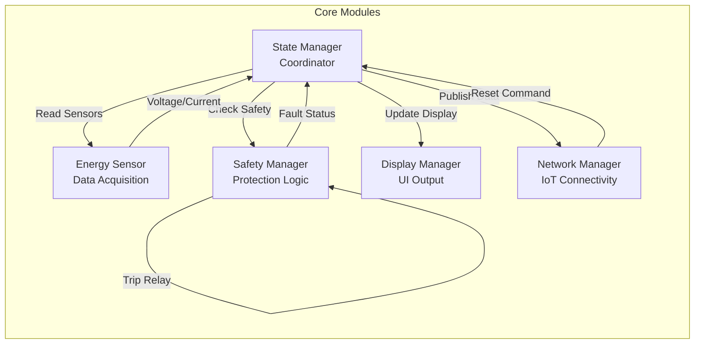

---

## 3.3 Hardware Configuration

### 3.3.1 Pin Assignment Table

| Component | GPIO Pin | Function | Type |
|-----------|----------|----------|------|
| ZMPT101B Voltage Sensor | GPIO 34 | Analog Input | ADC1_CH6 |
| SCT-013 Current Sensor | GPIO 35 | Analog Input | ADC1_CH7 |
| Relay Module | GPIO 26 | Digital Output | Control |
| RGB LED - Red | GPIO 25 | PWM Output | Status |
| RGB LED - Green | GPIO 33 | PWM Output | Status |
| RGB LED - Blue | GPIO 32 | PWM Output | Status |
| SSD1306 Display - SDA | GPIO 21 | I2C Data | Communication |
| SSD1306 Display - SCL | GPIO 22 | I2C Clock | Communication |

### 3.3.2 Hardware Block Diagram

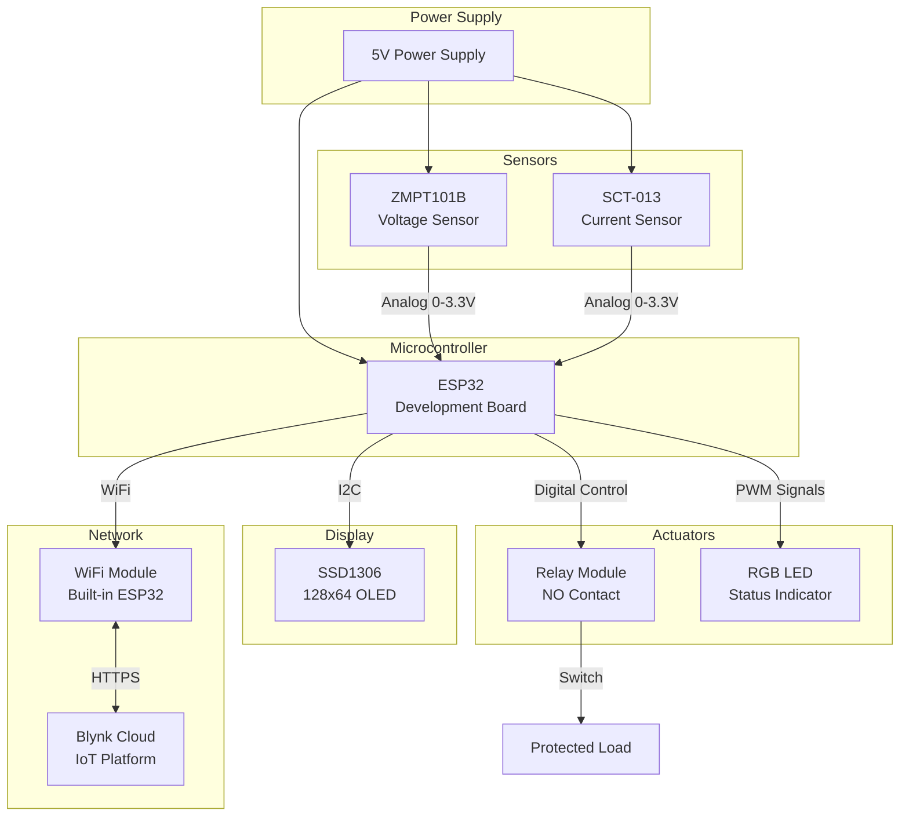

---

## 3.4 Software Architecture

### 3.4.1 Class Diagram

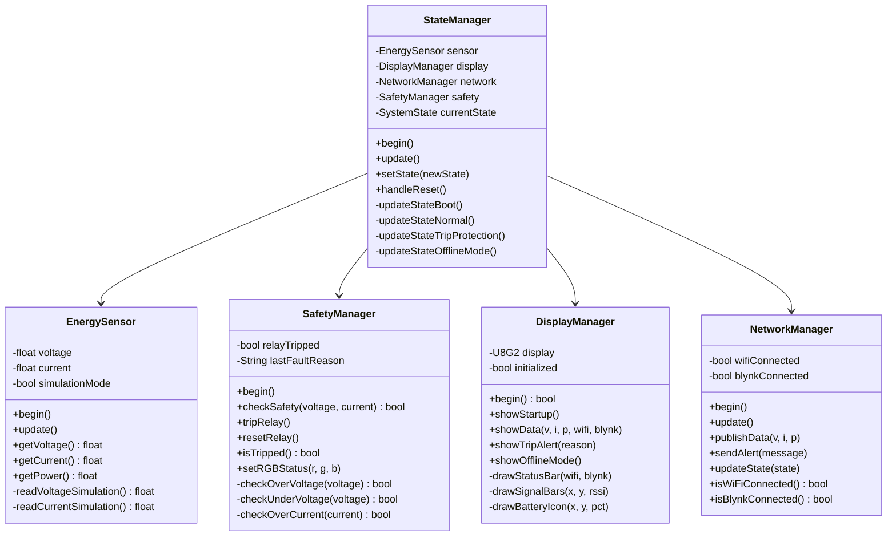

### 3.4.2 State Machine Diagram

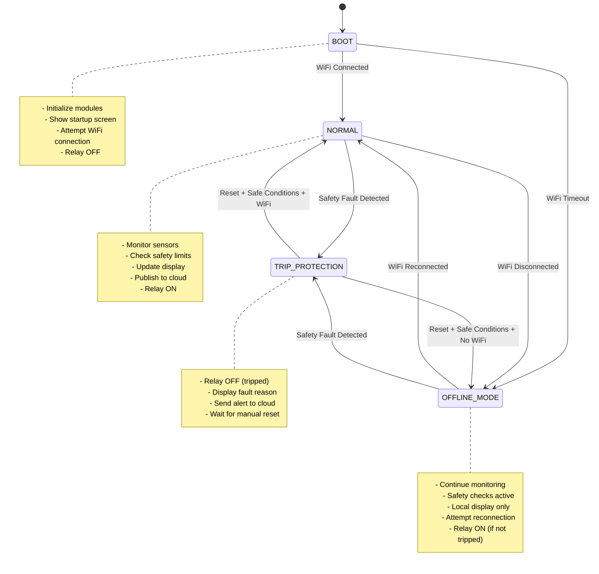

---

## 3.5 Algorithm Design

### 3.5.1 Main Control Loop Algorithm

**Pseudocode:**
```
ALGORITHM MainControlLoop
BEGIN
    INITIALIZE all modules (sensors, display, network, safety)
    SET state = BOOT
    DISPLAY startup screen
    
    WHILE system is running DO
        CALL StateManager.update()
        
        SWITCH current_state DO
            CASE BOOT:
                IF WiFi connected THEN
                    TRANSITION to NORMAL state
                ELSE IF timeout exceeded THEN
                    TRANSITION to OFFLINE_MODE state
                END IF
                
            CASE NORMAL:
                READ sensor values (voltage, current)
                CHECK safety conditions
                IF fault detected THEN
                    TRIP relay
                    TRANSITION to TRIP_PROTECTION state
                ELSE IF WiFi disconnected THEN
                    TRANSITION to OFFLINE_MODE state
                ELSE
                    UPDATE display with sensor data
                    PUBLISH data to cloud
                    ENERGIZE relay
                END IF
                
            CASE OFFLINE_MODE:
                READ sensor values
                CHECK safety conditions
                IF fault detected THEN
                    TRIP relay
                    TRANSITION to TRIP_PROTECTION state
                ELSE IF WiFi reconnected THEN
                    TRANSITION to NORMAL state
                ELSE
                    UPDATE display (offline mode)
                    ENERGIZE relay (if not tripped)
                END IF
                
            CASE TRIP_PROTECTION:
                READ sensor values (for monitoring)
                DISPLAY fault alert
                PUBLISH fault to cloud
                KEEP relay OFF
                IF reset button pressed AND conditions safe THEN
                    CLEAR fault
                    TRANSITION to NORMAL or OFFLINE_MODE
                END IF
        END SWITCH
        
        YIELD to prevent watchdog timeout
    END WHILE
END
```

### 3.5.2 RMS Calculation Algorithm (Single-Pass)

**Mathematical Foundation:**

The Root Mean Square (RMS) value of an AC signal is calculated using the formula:

$$
V_{RMS} = \sqrt{\frac{1}{N}\sum_{i=1}^{N}(v_i - \bar{v})^2}
$$

Where:
- $v_i$ = individual sample value
- $\bar{v}$ = mean (DC bias)
- $N$ = number of samples

This can be optimized to a single-pass algorithm using:

$$
V_{RMS} = \sqrt{\frac{\sum v_i^2}{N} - \left(\frac{\sum v_i}{N}\right)^2}
$$

**Pseudocode:**
```
ALGORITHM CalculateRMS_SinglePass
INPUT: sensor_pin, num_samples, calibration_factor
OUTPUT: calibrated_voltage

BEGIN
    sum_raw ← 0
    sum_squared_raw ← 0
    
    // Single sampling pass
    FOR i = 1 TO num_samples DO
        raw_adc ← READ_ANALOG(sensor_pin)
        sum_raw ← sum_raw + raw_adc
        sum_squared_raw ← sum_squared_raw + (raw_adc × raw_adc)
        DELAY_MICROSECONDS(100)
    END FOR
    
    // Calculate mean (DC bias)
    mean ← sum_raw / num_samples
    
    // Calculate variance
    mean_square ← (sum_squared_raw / num_samples) - (mean × mean)
    
    // Handle numerical errors
    IF mean_square < 0 THEN
        mean_square ← 0
    END IF
    
    // Calculate RMS in ADC counts
    rms_adc ← SQRT(mean_square)
    
    // Convert to voltage
    rms_voltage ← (rms_adc / 4095) × 3.3
    
    // Apply calibration
    actual_voltage ← rms_voltage × calibration_factor
    
    // Noise gate
    IF actual_voltage < NOISE_THRESHOLD THEN
        actual_voltage ← 0
    END IF
    
    RETURN actual_voltage
END
```

### 3.5.3 Safety Check Algorithm with Power Detection

**Flowchart:**

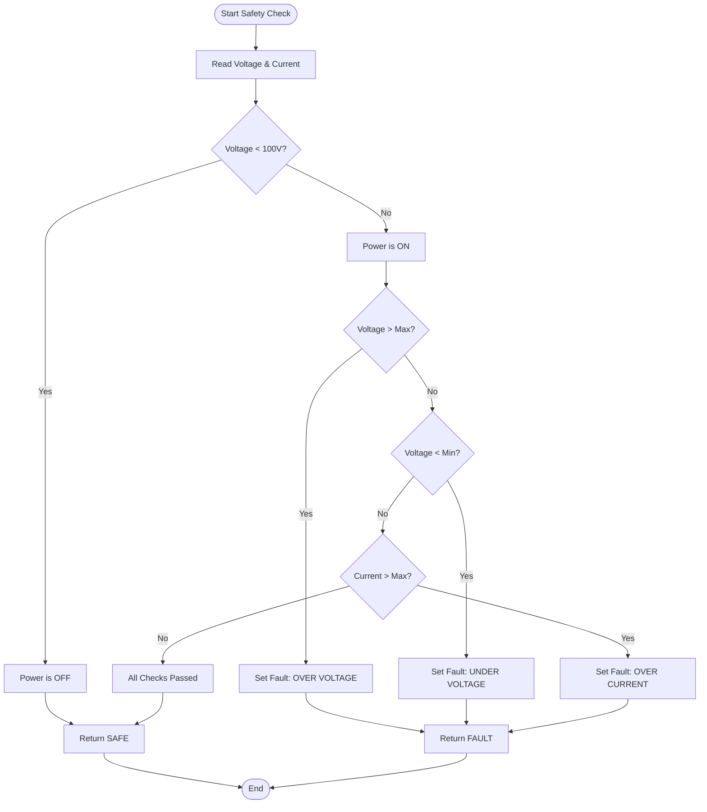

**Pseudocode:**
```
ALGORITHM CheckSafety
INPUT: voltage, current
OUTPUT: is_safe (boolean), fault_reason (string)

BEGIN
    // Power present detection
    IF voltage < POWER_PRESENT_THRESHOLD THEN
        // Power is OFF - normal condition
        RETURN (TRUE, "")
    END IF
    
    // Power is ON - check safety limits
    
    // Check over-voltage with hysteresis
    IF relay_tripped THEN
        over_voltage_limit ← VOLTAGE_MAX - VOLTAGE_HYSTERESIS
    ELSE
        over_voltage_limit ← VOLTAGE_MAX
    END IF
    
    IF voltage > over_voltage_limit THEN
        fault_reason ← "OVER VOLTAGE"
        RETURN (FALSE, fault_reason)
    END IF
    
    // Check under-voltage with hysteresis
    IF relay_tripped THEN
        under_voltage_limit ← VOLTAGE_MIN + VOLTAGE_HYSTERESIS
    ELSE
        under_voltage_limit ← VOLTAGE_MIN
    END IF
    
    IF voltage < under_voltage_limit THEN
        fault_reason ← "UNDER VOLTAGE"
        RETURN (FALSE, fault_reason)
    END IF
    
    // Check over-current with hysteresis
    IF relay_tripped THEN
        over_current_limit ← CURRENT_MAX - CURRENT_HYSTERESIS
    ELSE
        over_current_limit ← CURRENT_MAX
    END IF
    
    IF current > over_current_limit THEN
        fault_reason ← "OVER CURRENT"
        RETURN (FALSE, fault_reason)
    END IF
    
    // All checks passed
    RETURN (TRUE, "")
END
```

### 3.5.4 Exponential Moving Average (EMA) Smoothing

**Mathematical Formula:**

$$
S_t = \alpha \cdot x_t + (1 - \alpha) \cdot S_{t-1}
$$

Where:
- $S_t$ = smoothed value at time $t$
- $x_t$ = raw measurement at time $t$
- $\alpha$ = smoothing factor (0 < α < 1)
- $S_{t-1}$ = previous smoothed value

**Pseudocode:**
```
ALGORITHM ApplyEMASmoothing
INPUT: raw_voltage, raw_current, alpha
OUTPUT: smoothed_voltage, smoothed_current

BEGIN
    // Check for power-off condition
    IF raw_voltage < NOISE_THRESHOLD THEN
        // Immediate reset on power loss
        smoothed_voltage ← 0
        smoothed_current ← 0
    ELSE
        // Normal smoothing
        
        // Initialize on first reading
        IF smoothed_voltage = 0 AND raw_voltage > 0 THEN
            smoothed_voltage ← raw_voltage
        END IF
        
        IF smoothed_current = 0 AND raw_current > 0 THEN
            smoothed_current ← raw_current
        END IF
        
        // Apply EMA filter
        smoothed_voltage ← alpha × raw_voltage + (1 - alpha) × smoothed_voltage
        smoothed_current ← alpha × raw_current + (1 - alpha) × smoothed_current
    END IF
    
    RETURN (smoothed_voltage, smoothed_current)
END
```

---

## 3.6 Data Flow Diagram

### 3.6.1 Level 0 DFD (Context Diagram)

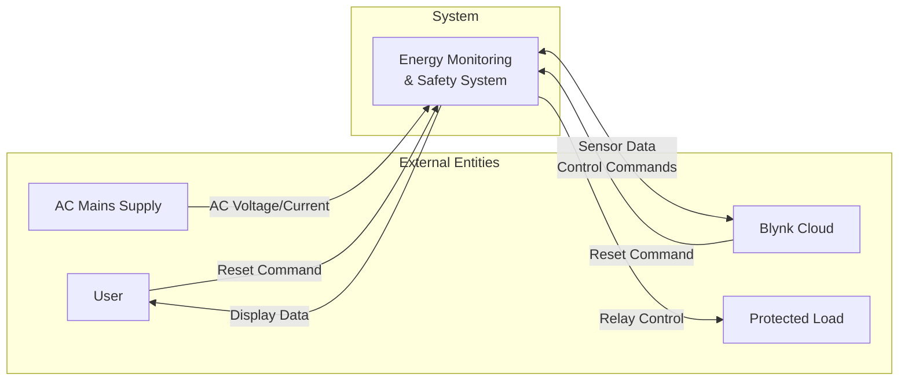

### 3.6.2 Level 1 DFD (System Processes)

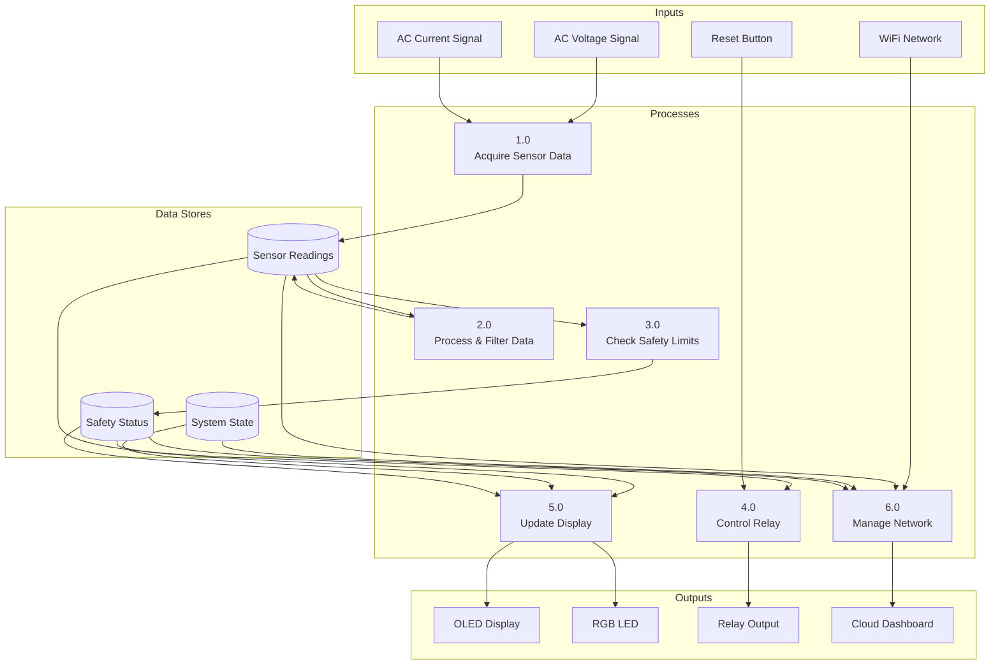

---

## 3.7 Implementation Methodology

### 3.7.1 Development Approach

The system was developed using an **Iterative and Incremental** approach:

1. **Module-Based Development**
   - Each component (sensor, display, safety, network) developed independently
   - Unit testing performed on individual modules
   - Integration performed incrementally

2. **Test-Driven Refinement**
   - Initial implementation with basic functionality
   - Real-world testing to identify issues
   - Iterative refinement based on empirical data

3. **Calibration-First Strategy**
   - Hardware validation before software integration
   - Sensor calibration using reference instruments
   - Threshold tuning based on actual operating conditions

### 3.7.2 Software Development Workflow

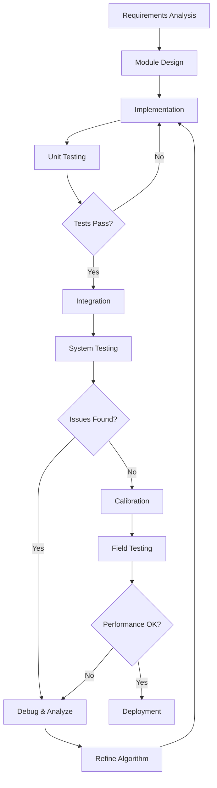

### 3.7.3 Calibration Procedure

**Step 1: Voltage Sensor Calibration**
```
1. Connect ZMPT101B to known AC source (verified with multimeter)
2. Enable raw RMS logging in firmware
3. Record raw RMS value from serial monitor
4. Calculate calibration factor:
   Calibration Factor = Actual Voltage (multimeter) / Raw RMS
5. Update VOLTAGE_CALIBRATION_FACTOR in config.h
6. Verify reading matches multimeter
7. Repeat if necessary
```

**Step 2: Current Sensor Calibration**
```
1. Connect known load (measured with clamp meter)
2. Enable raw RMS logging for current
3. Record raw RMS value
4. Calculate calibration factor:
   Calibration Factor = Actual Current (meter) / Raw RMS
5. Update current calibration in code
6. Verify with multiple load conditions
```

**Step 3: Threshold Tuning**
```
1. Measure noise floor with power OFF
2. Set VOLTAGE_NOISE_THRESHOLD above noise floor
3. Test trip thresholds with variable input
4. Adjust VOLTAGE_MIN/MAX based on grid stability
5. Configure hysteresis to prevent chattering
```

---

## 3.8 Safety System Design

### 3.8.1 Triple-Layer Protection Strategy

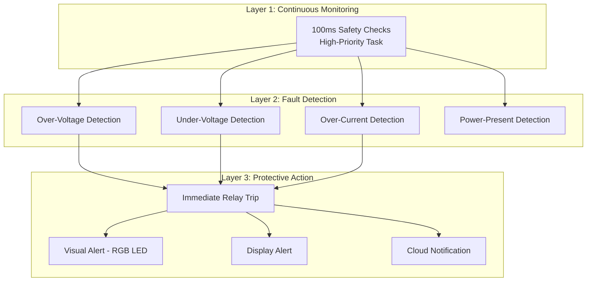

### 3.8.2 Hysteresis Implementation

To prevent relay chattering near threshold boundaries, hysteresis is implemented:

```
Trip Threshold:   216V (VOLTAGE_MIN)
Reset Threshold:  221V (VOLTAGE_MIN + HYSTERESIS)

State Transition:
- If NOT tripped: Trip when voltage < 216V
- If tripped: Reset only when voltage > 221V
```

**Hysteresis Diagram:**

```
Voltage (V)
    ^
250 |                    Normal Operation
    |    ════════════════════════════════
244 |    ← VOLTAGE_MAX (Trip threshold)
    |    ════════════════════════════════
240 |                    Safe Zone
    |
230 |
    |
221 |    ════════════════════════════════
    |    ← Reset threshold (MIN + HYST)
216 |    ════════════════════════════════
    |    ← VOLTAGE_MIN (Trip threshold)
    |
200 |              Under-Voltage Zone
    |
    +-----------------------------------> Time
    
    Hysteresis Band = 5V
```

---

## 3.9 Network Communication Architecture

### 3.9.1 IoT Communication Flow

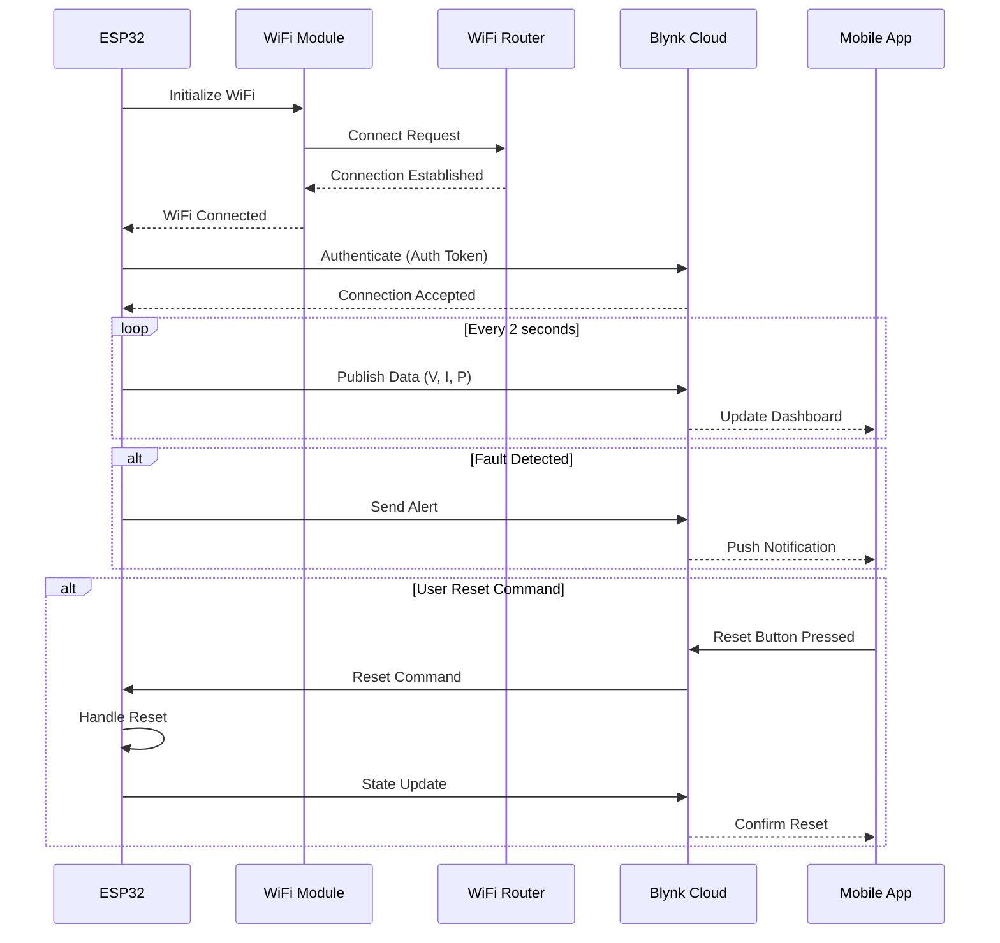

### 3.9.2 Data Packet Structure

**Sensor Data Packet (Published every 2s):**
```
{
    "voltage": float,      // Volts (V)
    "current": float,      // Amperes (A)
    "power": float,        // Watts (W)
    "timestamp": long      // Unix timestamp
}
```

**State Update Packet:**
```
{
    "state": string,       // "NORMAL", "TRIP: reason", "OFFLINE"
    "timestamp": long
}
```

**Alert Packet:**
```
{
    "event": "safety_alert",
    "message": string,     // Fault reason
    "voltage": float,
    "current": float,
    "timestamp": long
}
```

---

## 3.10 Display Interface Design

### 3.10.1 Screen Layout Structure

```
┌────────────────────────────────┐
│ ACTIVE  [WiFi] [Blynk] [Batt] │ ← Status Bar (12px)
├────────────────────────────────┤
│                                │
│  VOLT                          │
│       223.5 V                  │ ← Voltage (Large)
│                                │
├────────────────────────────────┤
│ CURR          │  PWR           │
│ 12.50 A       │  2.79 kW       │ ← Current & Power
│                                │
└────────────────────────────────┘
```

### 3.10.2 Display State Machine

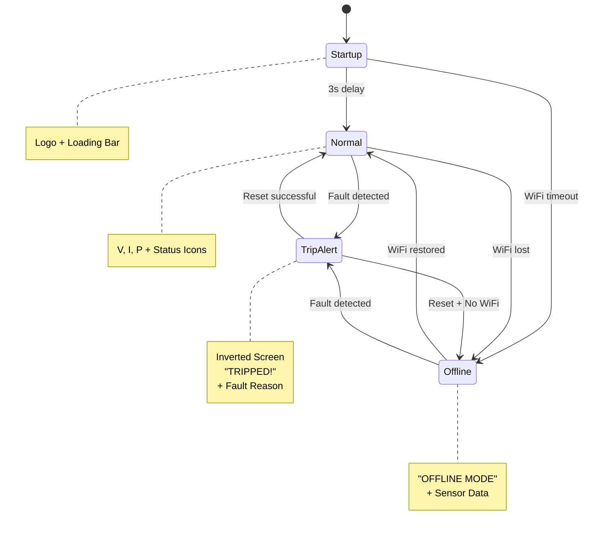

---

## 3.11 Timing and Scheduling

### 3.11.1 Task Timing Diagram

```
Time (ms)
    0   100  200  300  400  500  600  700  800  900  1000
    |    |    |    |    |    |    |    |    |    |    |
    
Safety Check (100ms)
    ▓    ▓    ▓    ▓    ▓    ▓    ▓    ▓    ▓    ▓    ▓
    
Sensor Read (500ms)
    ▓▓▓▓▓                   ▓▓▓▓▓                   ▓▓▓▓▓
    
Display Update (1000ms)
    ▓▓▓▓▓▓▓▓▓▓▓▓▓▓▓▓▓▓▓▓▓▓▓▓▓▓▓▓▓▓▓▓▓▓▓▓▓▓▓▓▓▓▓▓▓▓▓▓▓▓▓
    
Blynk Publish (2000ms)
    ▓▓▓▓▓▓▓▓▓▓▓▓▓▓▓▓▓▓▓▓▓▓▓▓▓▓▓▓▓▓▓▓▓▓▓▓▓▓▓▓▓▓▓▓▓▓▓▓▓▓▓
    
Legend:
    ▓ = Task executing
    | = Time marker
```

### 3.11.2 Priority Levels

| Task | Interval | Priority | Rationale |
|------|----------|----------|-----------|
| Safety Check | 100ms | CRITICAL | Fast fault detection |
| Sensor Read | 500ms | HIGH | Fresh data for safety |
| Display Update | 1000ms | MEDIUM | User feedback |
| Network Update | Continuous | MEDIUM | Non-blocking |
| Blynk Publish | 2000ms | LOW | Throttled by library |

---

## 3.12 Error Handling Strategy

### 3.12.1 Fault Recovery Flowchart

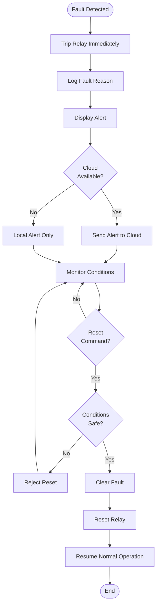

### 3.12.2 Watchdog Protection

```cpp
// Implemented via yield() in main loop
void loop() {
    stateManager.update();
    yield();  // Prevent watchdog timeout
}
```

---

## 3.13 Testing Methodology

### 3.13.1 Test Categories

1. **Unit Testing**
   - Individual module functionality
   - Sensor reading accuracy
   - Safety logic correctness

2. **Integration Testing**
   - Module interaction
   - State transitions
   - Data flow validation

3. **System Testing**
   - End-to-end functionality
   - Real-world conditions
   - Performance under load

4. **Calibration Testing**
   - Sensor accuracy verification
   - Threshold validation
   - Noise immunity

### 3.13.2 Test Cases Summary

| Test ID | Category | Description | Expected Result |
|---------|----------|-------------|-----------------|
| TC-01 | Safety | Over-voltage trip | Relay trips at >250V |
| TC-02 | Safety | Under-voltage trip | Relay trips at <216V |
| TC-03 | Safety | Over-current trip | Relay trips at >30A |
| TC-04 | Safety | Power-off no trip | No trip at 0V |
| TC-05 | Sensor | Voltage accuracy | ±2% of multimeter |
| TC-06 | Sensor | Current accuracy | ±5% of clamp meter |
| TC-07 | Network | WiFi connection | Connects in <20s |
| TC-08 | Network | Blynk publish | Data updates every 2s |
| TC-09 | Display | Normal mode | Shows V, I, P correctly |
| TC-10 | Display | Trip alert | Shows inverted screen |

---

## 3.14 Summary

This chapter presented a comprehensive methodology for the Smart Energy Monitoring and Safety System, covering:

- **System Architecture**: Modular, layered design with clear separation of concerns
- **Algorithms**: Single-pass RMS calculation, EMA smoothing, and intelligent safety checks
- **State Machine**: Four-state FSM with robust transition logic
- **Safety Design**: Triple-layer protection with hysteresis and power-present detection
- **Network Integration**: IoT connectivity with Blynk cloud platform
- **Testing Strategy**: Multi-level testing from unit to system validation

The methodology emphasizes:
1. **Reliability**: Redundant safety checks and fault tolerance
2. **Accuracy**: Calibrated sensors with noise filtering
3. **Usability**: Clear visual feedback and remote monitoring
4. **Maintainability**: Modular code structure with comprehensive documentation

The implementation successfully balances theoretical rigor with practical engineering constraints, resulting in a robust and deployable energy monitoring solution.
