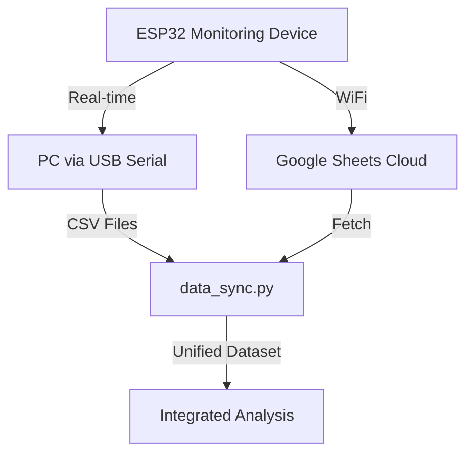

# Hybrid Performance Analysis Guide 📊

This guide explains how to combine and analyze data from two sources:
1.  **USB Serial Interface**: High-resolution data logged locally to your PC.
2.  **Google Sheets Cloud**: Continuous data logged remotely over WiFi.

---

## 🏗️ System Architecture



---

## 🛠️ Prerequisites

### Python Dependencies
Install the required libraries to handle data processing and cloud communication:
```bash
pip install -r tools/analysis/requirements.txt
```

### Google Apps Script Preparation
Ensure your Apps Script is updated with the latest code from `docs/google_apps_script.js`. This script includes the `doGet` function required for data retrieval.

---

## 🔄 Synchronizing Data

The synchronization process merges cloud data into your local CSV files while automatically handling duplicates (deduplication).

### Running Sync
```bash
python tools/data_sync.py
```

### Troubleshooting Common Errors

#### ❌ `NameResolutionError` / `Failed to resolve 'script.googleusercontent.com'`
- **Cause**: Your computer is having trouble reaching Google's servers.
- **Solution**: 
  - Check your internet connection.
  - Check if you are behind a corporate firewall or VPN that blocks Google Script.
  - Try again after a few minutes; DNS issues are often temporary.

#### ❌ `Cloud error: Sheet not found: TripResponse`
- **Cause**: The script is looking for a tab named exactly "TripResponse" but couldn't find it.
- **Solution**: 
  - Open your Google Sheet.
  - Ensure you have exactly 4 tabs named: `SystemEvents`, `Latency`, `Accuracy`, and `TripResponse`.
  - Check for trailing spaces in the tab names.

---

## 📈 Running the Analysis

Once your data is synced, you can generate comprehensive reports.

### Option 1: Full Automated Workflow
This command will first sync your cloud data and then run all performance reports automatically.
```bash
cd tools/analysis
python integrated_analysis.py
```

### Option 2: Manual Report Generation
If you want to generate the final documentation report after running individual analyses:
```bash
python tools/analysis/generate_report.py
```

---

## 🧩 Data Comparison Matrix

| Metric | Google Sheets (WiFi) | USB Serial (tools/performance_logger.py) |
| :--- | :--- | :--- |
| **Reliability** | Depends on WiFi stability | Depends on USB connection |
| **Outage Coverage** | Stops when WiFi router dies | Continues as long as laptop is ON/Battery |
| **Frequency** | Throttled to save bandwidth | Full speed (up to 10Hz) |
| **Persistence** | Permanent Cloud Storage | Local CSV files |

---

## ✅ Best Practices for Data Quality

1.  **Run Sync Regularly**: Pull cloud data at the end of every testing session.
2.  **Clear Local Files if Corrupted**: If headers get messed up, you can delete the CSVs in `tools/performance_data/` and run `data_sync.py` to restore everything from the cloud.
3.  **Check Heartbeats**: Use the `SystemEvents` tab in Google Sheets to verify the system was up during periods where performance data might be missing.
